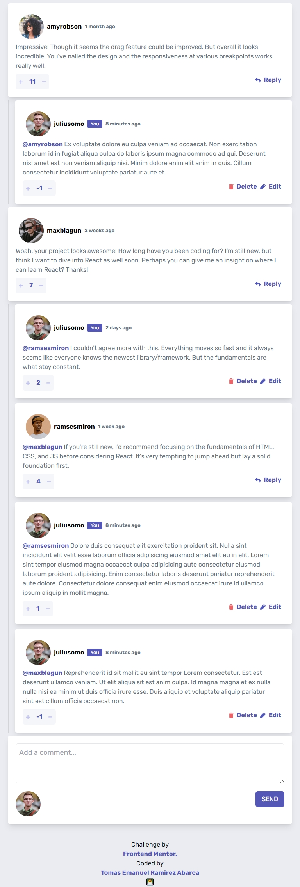

# VS Frontend Mentor - Interactive comments section 📝 
This is a solution to the [Interactive comments section challenge on Frontend Mentor](https://www.frontendmentor.io/challenges/interactive-comments-section-iG1RugEG9). Frontend Mentor challenges help you improve your coding skills by building realistic projects. 

## Table of contents

- [Overview](#overview)
  - [The challenge](#the-challenge)
  - [Screenshot](#screenshot)
  - [Links](#links)
- [My process](#my-process)
  - [Built with](#built-with)
  - [What I learned](#what-i-learned)
  - [Continued development](#continued-development)  
- [Author](#author)

## Overview
### The challenge

Users should be able to:

- View the optimal layout for the app depending on their device's screen size
- See hover states for all interactive elements on the page
- Create, Read, Update, and Delete comments and replies
- Upvote and downvote comments
- **Bonus**: If you're building a purely front-end project, use `localStorage` to save the current state in the browser that persists when the browser is refreshed.
- **Bonus**: Instead of using the `createdAt` strings from the `data.json` file, try using timestamps and dynamically track the time since the comment or reply was posted.

### Screenshot

### Links

- Solution URL: [Add solution URL here](https://your-solution-url.com)
- Live Site URL: [netlify](https://glittery-kataifi-e66cb6.netlify.app/)

## My process
### Built with

- Semantic HTML5 markup
- Flexbox
- CSS Grid 
- CSS Flex
- Javascript Vanilla
- [React](https://reactjs.org/) - JS library- 
- [Tailwindcss](https://tailwindcss.com/) - For styles
- [ViteJs](https://vitejs.dev/) 
- [Standard](https://github.com/standard/standard) eslintConfig

### What I learned
This challenge help me to improve my knowleges of ReactJs, Tailwindcss and ViteJs

### Continued development
I would like to improve my skills with Hooks, Context, Reduces, etc. in Reactjs 

## Author
- Linkedin - [@emanuelramirezabarca](https://www.linkedin.com/in/emanuelramirezabarca/)
- Frontend Mentor - [@emanuel-ra](https://www.frontendmentor.io/profile/emanuel-ra)
